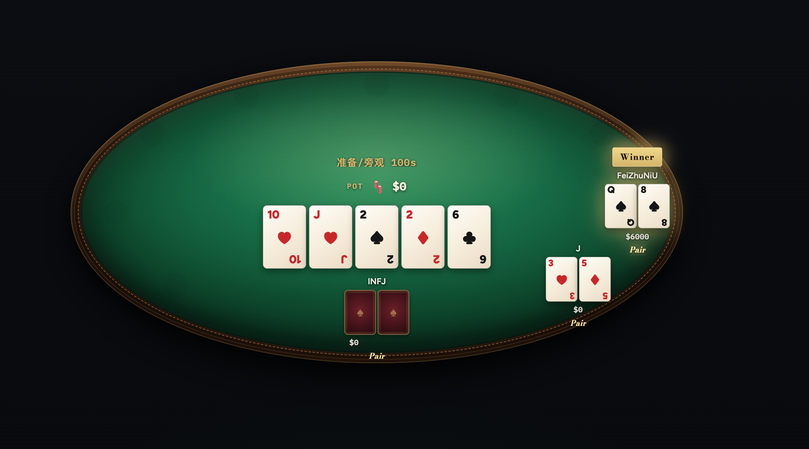

<div align="center">



# All-In

### 浏览器里开一桌德州扑克 · 朋友之间，随时 All-In

开箱即用 · 局域网 / 云服务器 · 手机横屏也能打

<br/>

[](https://github.com/FeiZhuNiU-INFJA/All-in/stargazers)
[](https://github.com/FeiZhuNiU-INFJA/All-in/network/members)
[](https://github.com/FeiZhuNiU-INFJA/All-in/watchers)
[](https://github.com/FeiZhuNiU-INFJA/All-in/issues)

[](LICENSE)
[](https://nodejs.org/)
[](https://socket.io/)
[](https://github.com/FeiZhuNiU-INFJA/All-in/pulls)

**[⭐ Star](https://github.com/FeiZhuNiU-INFJA/All-in)** ·
**[🍴 Fork](https://github.com/FeiZhuNiU-INFJA/All-in/fork)** ·
**[🐛 Issues](https://github.com/FeiZhuNiU-INFJA/All-in/issues)**

</div>

---

## 为什么是 All-In？

周末想开一局，却不想下 App、不想注册、不想碰真钱。

**All-In** 就是给朋友局准备的轻量德州房间：浏览器打开，四位房间码进桌，牌桌氛围拉满——发牌动画、筹码飞入、轮到谁闪一下，手机横屏也打得舒服。

> 玩码不是赌资。输光了可以补码，但名字旁会多一枚 **耻辱币** 😈

---

## ✨ 功能亮点

| | |
| :--- | :--- |
| 🎰 **No-Limit Hold'em** | 2–10 人一桌，标准无限注德州 |
| 🔑 **四位房间码** | 创建 / 加入，发给朋友就能开打 |
| 📱 **手机 + 电脑** | 横屏优先的牌桌布局，安全区不挡按钮 |
| 🔌 **断线重连** | 短暂掉线有宽限期，回来还能坐回原位 |
| 💺 **固定座位** | 随机入座，视角相对自己旋转，永远坐在下方 |
| 💰 **补码 / 旁观** | 初始 2000；输光 +2000 或先观战 |
| 🏠 **LAN / 云端** | 家里 Wi‑Fi 开黑，或挂一台小服务器 |

---

## 🚀 快速开始

需要 **Node.js 18+** 和 **Yarn**。

```bash
git clone https://github.com/FeiZhuNiU-INFJA/All-in.git
cd All-in
yarn install
yarn start
```

默认监听 `0.0.0.0:5714`。终端会打印本机与局域网地址，例如：

```text
Friends on your LAN can open http://192.168.1.23:5714
```

### 局域网开黑

1. 本机 `yarn start`
2. 朋友连同一个 Wi‑Fi
3. 打开终端里打印的 `http://局域网IP:5714`

### 挂到云服务器

```bash
PORT=5714 yarn start
# 或常驻（公网 + HTTPS 时绑本机，不对公网暴露 5714）：
# HOST=127.0.0.1 PORT=5714 npx pm2 start src/app.js --name all-in
```

把 `5714` 放行（或只对本机开放，见下方 HTTPS），朋友访问：

```text
http://你的服务器IP:5714
```

生产环境建议用 `pm2` / `systemd` / Docker 守护进程。配好 HTTPS 后应使用：

```bash
HOST=127.0.0.1 PORT=5714 npx pm2 start src/app.js --name all-in
```

这样 `http://IP:5714` 从外网不可达，只能走 `https://IP/`（Caddy 反代本机 5714）。安全组也可关掉对公网的 **5714**，只留 **80/443**。
### HTTPS（语音 / 麦克风需要）

**All-In 本身只提供 HTTP**（`src/app.js` 监听 `5714`）。浏览器开麦要求 **HTTPS 安全上下文**，所以公网部署时要在前面加一层 **反向代理** 做 TLS 终结。

常见架构：

```text
浏览器 ──HTTPS:443──▶ Caddy / Nginx ──HTTP:5714──▶ Node (pm2)
```

#### 有域名（推荐）

用 [Caddy](https://caddyserver.com/) 或 Nginx + Let's Encrypt，自动申请受信任证书。示例 Caddyfile：

```text
poker.example.com {
    reverse_proxy 127.0.0.1:5714
}
```

安全组放行 **80**（签证书）和 **443**；`5714` 可不对公网开放。

#### 只有公网 IP（当前方案）

没有域名时无法用 Let's Encrypt 正规证书，可用 **Caddy + 自签证书**：

1. 生成证书（示例 IP `124.222.166.163`，按需替换）：

```bash
sudo mkdir -p /etc/caddy/certs
sudo openssl req -x509 -nodes -newkey rsa:2048 \
  -keyout /etc/caddy/certs/all-in.key \
  -out /etc/caddy/certs/all-in.crt -days 825 \
  -subj "/CN=124.222.166.163" \
  -addext "subjectAltName=IP:124.222.166.163"
sudo chown root:caddy /etc/caddy/certs/all-in.*
```

2. `/etc/caddy/Caddyfile`：

```text
{
    auto_https off
}

:443 {
    tls /etc/caddy/certs/all-in.crt /etc/caddy/certs/all-in.key
    reverse_proxy 127.0.0.1:5714
}

:80 {
    redir https://{host}{uri} permanent
}
```

3. `sudo systemctl reload caddy`，安全组放行 **443**。

访问 `https://你的公网IP/`；首次需在浏览器点 **高级 → 继续访问**（自签证书警告）。之后即可满足 HTTPS，为后续语音功能做准备。

> 说明：`sslip.io` 等免费二级域名在部分云厂商网络下可能被拦截，有域名时仍建议用自己的域名 + Let's Encrypt。

---

## 🃏 怎么玩

1. 一人点 **创建房间**，输入昵称，把房间码甩出去  
2. 其他人 **加入房间**，填昵称 + 房间码  
3. 至少 2 人后，房主点开始  
4. 每手之间选 **准备好** 或 **旁观**

### 规则速览

- 玩码筹码，**不是真钱**
- 初始 **2000**，两手之间可补码 **+2000**（多一枚耻辱币）
- 对局中断线视为弃牌（宽限期内可重连）
- 服务重启后房间清空（无持久化）

---

## 🛠 开发

```bash
yarn dev    # 热重载
yarn test   # 单测
```

**技术栈：** Node.js · Express · Socket.IO · pokersolver · 原生前端

```text
src/
├── app.js           # HTTP + Socket 入口
├── classes/         # Game / Player
└── client/          # 牌桌 UI
```

---

## 📈 Star History

如果这个小项目帮你开过一场快乐的朋友局，点个 Star 就是最大的支持 ⭐

[](https://www.star-history.com/#FeiZhuNiU-INFJA/All-in&Date)

---

## 👥 Contributors

<a href="https://github.com/FeiZhuNiU-INFJA/All-in/graphs/contributors">
  
</a>

欢迎提 Issue / PR。玩得开心的话，点个 Star 让更多朋友看见 ⭐

---

## 📄 License

[MIT](LICENSE) — 随便 fork、改、部署，请朋友们一起 All-In。

<div align="center">

<br/>

**Made for friend-game nights.**

[回到顶部](#all-in)

</div>
